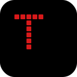

<p align="center">
  
</p>

<h1 align="center">Tex</h1>

<p align="center">
  <b>Super minimal, super fast video / audio downloader</b><br>
  Python + PySide6 · iOS-inspired · Dark & Light themes
</p>

<p align="center">
  
  
  
</p>

---

## Screenshots

| Download | Queue | Channels |
|:--------:|:-----:|:--------:|
|  |  |  |

| History | Settings |
|:-------:|:--------:|
|  |  |

---

## Features

- **Paste & go** — Ctrl+V a URL, pick quality, click Download. Done.
- **Multi-URL paste** — paste 10 links at once, they all queue up automatically.
- **Channel bulk download** — paste a YouTube channel URL, fetch 100+ videos, pick which to download.
- **6 themes** — Dark, Light, Nord, Solarized, Cyberpunk, Forest. Live-togglable.
- **Browser cookies auto-extracted** — Chrome, Edge, Firefox, Brave, Opera, Vivaldi. Age-restricted content works out of the box. No manual `cookies.txt`.
- **Concurrent queue** — unlimited downloads with pause, cancel, clear.
- **Quality picker** — MP4 (4K → 360p) and MP3 (320 / 192 / 128 kbps) with file size preview.
- **ID3 tagging** — MP3s get title, artist, album art automatically.
- **Filename templates** — `{title} [{quality}].{ext}` and more.
- **Sound effects** — tick, fetch, queue, done, error. Toggleable.
- **System tray** — minimize to tray, paste URL from tray menu.
- **Clipboard auto-detect** — copies a URL, Tex picks it up.
- **Drag & drop** — drop URLs onto the window.
- **Edge resize** — drag any edge of the frameless window to resize.

## Quick start

```bash
pip install PySide6 yt-dlp imageio-ffmpeg
python main.py
```

On first launch Tex prompts for a save folder, then creates `Video/` and `Audio/` subfolders inside it.

## Keyboard shortcuts

| Shortcut | Action |
|----------|--------|
| `Ctrl+V` | Paste URL |
| `Ctrl+L` | Focus URL bar |
| `Enter` | Fetch metadata |
| `Esc` | Cancel all downloads |
| `Ctrl+,` | Settings |
| `Ctrl+H` | History |
| `Ctrl+J` | Queue |
| `Ctrl+1–4` | Switch tabs |

## Filename template tokens

`{title}` · `{channel}` · `{quality}` · `{id}` · `{date}` · `{ext}`

Example: `{channel} - {title} [{quality}].{ext}` → `jawed - Me at the zoo [1080p].mp4`

## Build a single .exe

```bash
pip install pyinstaller
python build.py
```

Output: `dist/Tex.exe`

## Architecture

```
tex/
├── main.py                    # entry point: splash → window
├── build.py                   # PyInstaller wrapper
├── assets/
│   ├── logo.svg               # app logo
│   ├── fonts/                 # dot-matrix TTF candidates
│   └── sounds/                # pre-generated WAVs
├── core/
│   ├── detector.py            # URL → platform
│   ├── metadata.py            # yt-dlp wrapper, ffmpeg discovery
│   ├── formats.py             # quality ladder (MP4 + MP3)
│   ├── downloader.py          # QThread + progress + pause/cancel
│   ├── queue.py               # N-slot FIFO with unlimited mode
│   ├── naming.py              # filename templates
│   ├── tags.py                # ID3 + cover art
│   ├── history.py             # last 50
│   ├── cookies.py             # browser auto-detection for yt-dlp
│   ├── clipboard.py           # URL watcher
│   ├── sound.py               # SoundManager (QSoundEffect)
│   ├── channel.py             # bulk channel fetcher
│   └── config.py              # ~/.tex/config.json
└── ui/
    ├── app.py                 # TexWindow — frameless, edge-resize
    ├── theme.py               # QSS — 6 themes, token-based
    ├── icons.py               # 29 hand-rolled SVG icons
    ├── anim.py                # animation helpers
    ├── shortcuts.py           # global QShortcut installer
    ├── tray.py                # system tray
    └── widgets/
        ├── title_bar.py       # 36px custom title bar
        ├── sidebar.py         # 168/60px collapsible nav
        ├── splash.py          # frameless splash + 3-dot loader
        ├── url_bar.py         # URL input with status dot
        ├── channel_panel.py   # bulk channel downloader
        ├── format_picker.py   # quality chips
        ├── progress_card.py   # per-item progress
        ├── dot_matrix.py      # pixel-art glyph library
        ├── icon_button.py     # SVG icon button classes
        └── ...                # tile / ring / segmented widgets
```

## UI tokens

All QSS colors are driven by tokens in `ui/theme.py`. Edit `_qss(...)` to retheme.

Key tokens: `accent` (`#D7191A`), `fg`, `fg_dim`, `bg`, `panel`, `hairline`, `hover`, `soft`, `danger`.

## Privacy

Tex never sends your URLs or downloads to any third party. All data lives in `~/.tex/` on your local machine.

## License

MIT
